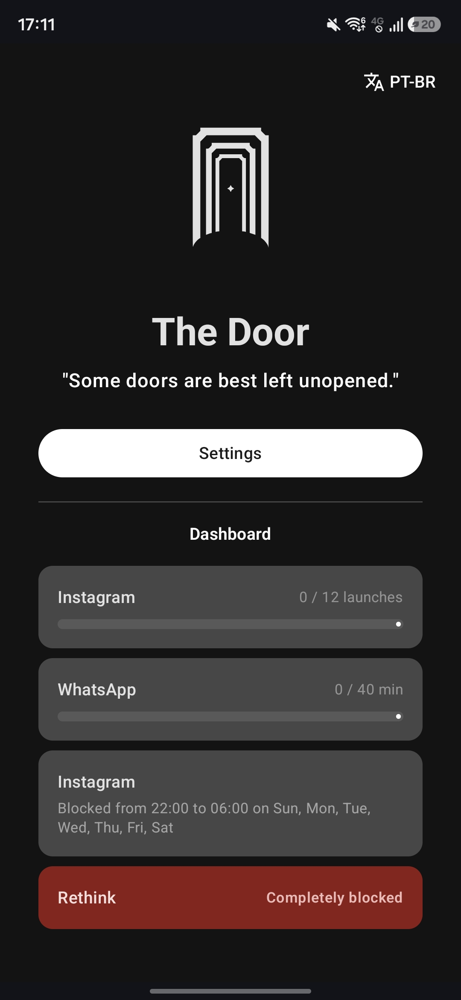
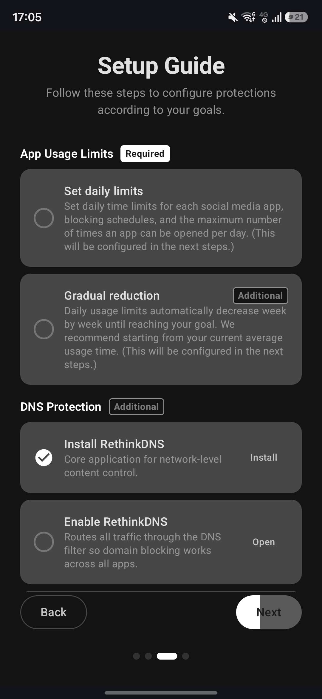

# The Door

> A self-imposed digital blocker for Android, designed to resist your future self.

*"Some doors are best left unopened."*

The Door is a free, open-source Android app that helps you reduce access to apps and websites you want to stay away from. Unlike standard screen time tools, it assumes that the user will try to disable it, so instead of relying on reminders or easy-to-dismiss timers, it combines multiple Android system mechanisms into a layered barrier that makes impulsive bypasses genuinely difficult.

There is no subscription, no account, no internet connection, and no data collection of any kind.

> **Note:** The Door probably cannot be published on the Google Play Store due to its use of the Accessibility Service API for enforcement purposes. It is distributed exclusively through GitHub.

## Screenshots

| Dashboard | Onboarding |
|---|---|
|  |  | 

## Protection Layers

The Door can combine up to five independent layers depending on your goals. Disabling one does not remove the others:

| Layer | What it does | When it applies |
|---|---|---|
| **Accessibility Service** | Detects when a blocked app opens and immediately redirects you away | Always |
| **Device Admin** | Prevents The Door from being uninstalled without first disabling admin rights | Always |
| **System Restrictions** | Blocks access to Developer Options, VPN settings, accessibility settings, and more | Always |
| **RethinkDNS** | Filters DNS queries to block domains at the network level | Social media (DNS blocking), adult content, or gambling |
| **Firefox + Extensions** | Replaces Chrome as your browser, with uBlock Origin and BlockNSFW enforced | Adult content |

The more layers you configure, the harder the system is to bypass. If you only want app time limits, the Accessibility Service alone is enough, the other layers add depth for stricter use cases.

## Features

### App Blocking and Limits
- Fully block any installed app
- Set a daily time limit per app (in minutes), with warnings at 15, 5, and 1 minute remaining
- Set a maximum number of daily opens per app
- Schedule block windows by day of the week and time range

### Gradual Reduction
Set an initial usage value and a goal. The Door automatically reduces your daily limit by ~10% each week until the goal is reached, no willpower required to keep tightening the limit.

### Time Saved Metrics
The main dashboard shows how many minutes you saved today, this week, and since installation, calculated from your historical usage versus your configured limits.

### Redirect on Block
When a blocked app is triggered, The Door can send you back to the home screen, back to The Door itself (with an optional motivational message you wrote during setup), or directly to another app of your choice, such as an e-book reader. The message reminds you of the reason you set the block in the first place.

### System Protections (13 toggles)
Individual toggles to restrict access to system settings that could be used to disable The Door:

- Accessibility settings
- Developer Options
- App info screens (blocks force-stop, data wipe, and admin deactivation)
- VPN configuration
- Private DNS settings
- Language settings
- Safe mode restart via power menu
- The Door's own uninstall screen
- Firefox uninstall (requires adult content selected during onboarding)
- Firefox settings and extensions (requires adult content selected during onboarding)
- Firefox: uBlock Origin (requires adult content selected during onboarding)
- Firefox: BlockNSFW (requires adult content selected during onboarding)
- RethinkDNS uninstall

### Third-Party PIN
A trusted person, a friend or family member, sets a 6-digit PIN that you should never know. This PIN is required to access The Door's settings. The idea is that you cannot unlock your own restrictions impulsively: changing your configuration requires asking someone else.

The PIN is secured with **Argon2id** (64 MiB memory cost, 3 iterations), stored in **SharedPreferences** with AES-256 GCM and backed by the Android Keystore. It is never stored in plaintext.

### Zero Trust Mode
Locks all configuration permanently with no PIN and no unlock mechanism. Depending on which protections you enabled, the only way to reconfigure or uninstall The Door after enabling Zero Trust may be a factory reset. Use with caution.

### Bilingual Support
The app and its system-level keyword detection (used to block settings screens) support **English** and **Brazilian Portuguese**. Your device language should be set to one of these for full protection coverage.

## Installation

### Download

Go to the [Releases](../../releases) page and download the latest APK.

### Install

Transfer the APK to your Android device and open it to install. You will need to allow installation from unknown sources when prompted.

Minimum Android version: **Android 8.0 (API 26)**

### Supporting Apps

Depending on your goals, The Door works alongside external apps for deeper protection. The onboarding checklist guides you through what to install based on what you want to block.

**[RethinkDNS](https://play.google.com/store/apps/details?id=com.celzero.bravedns)** - DNS filtering and VPN firewall. Needed if you want to block social media domains, adult content, or gambling sites at the network level.

**[Firefox for Android](https://play.google.com/store/apps/details?id=org.mozilla.firefox)** - Required only for adult content blocking, due to its extension support. Install these extensions from within Firefox:
- **[uBlock Origin](https://addons.mozilla.org/firefox/addon/ublock-origin/)** - Content filtering
- **[BlockNSFW](https://addons.mozilla.org/en-US/firefox/addon/blocknsfw-porn-adult-content/)** - Image-level NSFW blocking

Neither app is required if you only want app time limits or blocking.

## Setup Overview

The Door walks you through setup in a guided sequence:

1. **Onboarding** - Choose what you want to control: social media and apps, adult content, or gambling. Includes an interactive checklist for configuring RethinkDNS, Firefox, and extensions
2. **App Limits** - Configure blocking, schedules, daily limits, and max opens per app
3. **Redirect Config** - Choose what happens when a blocked app is triggered
4. **Protection Settings** - Enable system-level restrictions
5. **Verification Checklist** - Confirm all permissions and components are active
6. **Lock** - Choose between a third-party PIN (handed to someone you trust) or Zero Trust mode (no unlock at all)

After locking, the dashboard becomes your active monitoring screen.

## Privacy

The Door has no internet permission, it cannot make network requests of any kind. There is no telemetry, no analytics, no remote configuration, and no data sent anywhere. All configuration is stored locally on your device. There are no accounts, no sign-up, and no cloud sync.

## Limitations

- System-level keyword detection for blocking settings screens currently supports **English and Brazilian Portuguese only**. If your device is set to another language, some protection toggles may not work correctly.
- Zero Trust mode may be irreversible without a factory reset, depending on which protections you enabled. Make sure your setup is complete and correct before enabling it, and always keep a backup of your device data.
- The Door does not block content accessed through apps it cannot monitor (e.g., embedded browsers within other apps). RethinkDNS, if configured, handles domain-level filtering for those cases.
- USB debugging (ADB) can bypass some restrictions. Disabling it is recommended before activating the app, and is included in the final verification checklist.
- This is a non-commercial personal project, shared with the hope that it can help people. How you configure and use it is your responsibility.

## Permissions

| Permission | Purpose |
|---|---|
| Accessibility Service | Core enforcement, detects when blocked apps open and redirects away |
| Usage Access | Calculates the average daily usage time of apps and is the fallback to app usage tracking |
| Device Administrator | Prevents The Door from being uninstalled without disabling admin rights first |
| Post Notifications | Sends warnings when a daily limit is about to be reached (15, 5, and 1 minute left) |
| Query Installed Apps | Enumerates installed apps so you can configure restrictions for each one |

The Door does not request the internet permission.

## License

Licensed under GPL v3.0 - see [`LICENSE`](./LICENSE) for details.
